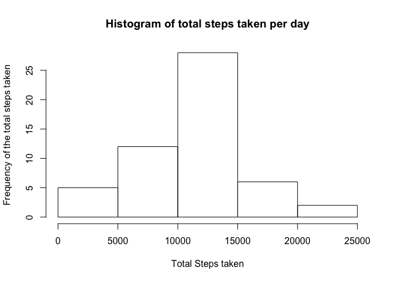
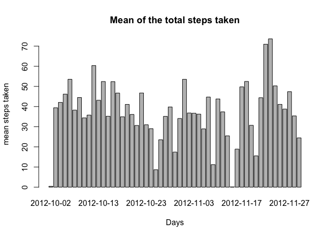
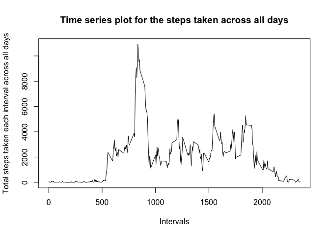
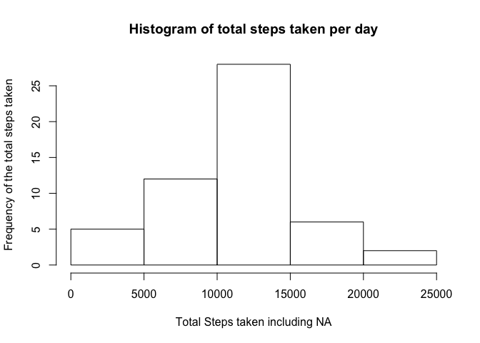
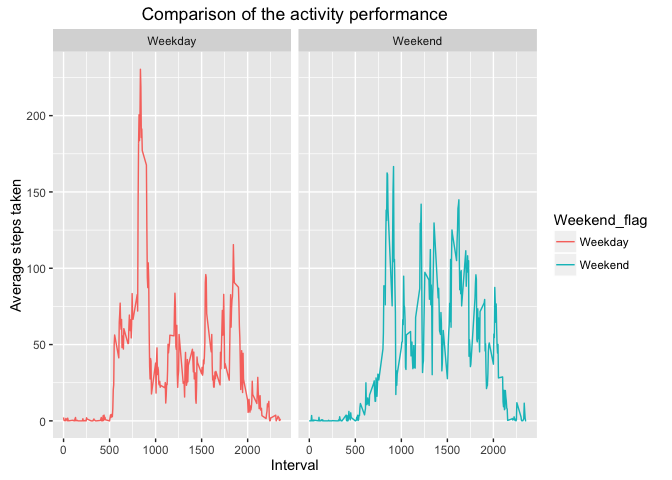

# PA Assignment1

#Coursera Reproducible research Peer assisment assignment 1: 

##code for reading the dataset and processing the same. 
1. Reading the data

```r
data<- read.csv("activity.csv")
data$date<- as.Date(as.character(data$date))
```
2.removing the data containing NA

```r
data_nona<-data[!is.na(data),]
```

##Histogram of the total number of steps taken each day
1. calculating the sum of the steps per day

```r
library(dplyr)
d<- tbl_df(data_nona)
day_hist<-group_by(d,date)
day_total_hist<-summarize(day_hist,sum(steps))
names(day_total_hist)<-c('dates','total_steps_taken')
hist(day_total_hist$total_steps_taken,main = 'Histogram of total steps taken per day',xlab = 'Total Steps taken', ylab = 'Frequency of the total steps taken')
```

<!-- -->

##mean and median of the number of steps taken each day 

```r
day_mean<-summarize(day_hist,mean(steps))
day_mean<-day_mean[complete.cases(day_mean),]
names(day_mean)<-c('dates','mean_steps_taken')
```

1. Mean Per day

```r
day_mean
```

```
## # A tibble: 53 × 2
##         dates mean_steps_taken
##        <date>            <dbl>
## 1  2012-10-02          0.43750
## 2  2012-10-03         39.41667
## 3  2012-10-04         42.06944
## 4  2012-10-05         46.15972
## 5  2012-10-06         53.54167
## 6  2012-10-07         38.24653
## 7  2012-10-09         44.48264
## 8  2012-10-10         34.37500
## 9  2012-10-11         35.77778
## 10 2012-10-12         60.35417
## # ... with 43 more rows
```

```r
barplot(day_mean$mean_steps_taken,names= day_mean$dates, xlab = "Days", ylab="mean steps taken",main = "Mean of the total steps taken")
```

<!-- -->

2. Median Per day

```r
day_median<-summarize(day_hist,median(steps))
day_median
```

```
## # A tibble: 54 × 2
##          date `median(steps)`
##        <date>           <dbl>
## 1  2012-10-02               0
## 2  2012-10-03               0
## 3  2012-10-04               0
## 4  2012-10-05               0
## 5  2012-10-06               0
## 6  2012-10-07               0
## 7  2012-10-09               0
## 8  2012-10-10               0
## 9  2012-10-11               0
## 10 2012-10-12               0
## # ... with 44 more rows
```

3. mean and median of the total steps taken in the entire interval

```r
paste("The mean of the steps taken is :",round(mean(day_total_hist$total_steps_taken,na.rm= TRUE)))
```

```
## [1] "The mean of the steps taken is : 10766"
```

```r
paste("The median of the steps taken is :",round(median(day_total_hist$total_steps_taken,na.rm= TRUE)))
```

```
## [1] "The median of the steps taken is : 10765"
```

##Time series plot for the average number of steps taken the entire day:

```r
interval_steps<-group_by(d,interval)
interval_total_steps<-summarise(interval_steps,sum(steps))
names(interval_total_steps)<-c('interval','total_steps_taken_each_interval')
plot(interval_total_steps$interval,interval_total_steps$total_steps_taken_each_interval,type = "l",xlab = "Intervals", ylab = "Total steps taken each interval across all days", main = "Time series plot for the steps taken across all days")
```

<!-- -->

##The 5 minute interval containing maximum number of average taken steps:

```r
interval_average_steps<-summarise(interval_steps,mean(steps,na.rm = TRUE))
names(interval_average_steps)<-c('interval','average_steps_per_interval')
interval_average_steps<-interval_average_steps[complete.cases(interval_average_steps),]
max_steps_interval<-max(interval_average_steps$average_steps_per_interval,na.rm= TRUE)

paste("maximum of the average steps taken for a interval is:",max_steps_interval," The same occurs at: ",interval_average_steps[interval_average_steps$average_steps_per_interval==max_steps_interval,]$interval)
```

```
## [1] "maximum of the average steps taken for a interval is: 206.169811320755  The same occurs at:  835"
```


##Code to describe to impute the missing data

```r
paste("Total number of values in the dataset containing the NA values is",nrow(data[is.na(data$steps),]))
```

```
## [1] "Total number of values in the dataset containing the NA values is 2304"
```

```r
paste("percentage of the values in the dataset containing the NA values is",(nrow(data[is.na(data$steps),])/nrow(data))*100,"%")
```

```
## [1] "percentage of the values in the dataset containing the NA values is 13.1147540983607 %"
```

1. adding the missing values with the mean of the steps taken each interval as there are some missing values per day.

```r
d1<-tbl_df(data)
for(i in 1:nrow(d1))
    {
    if(is.na(d1[i,]$steps))
    {
        d1[i,]$steps<-interval_average_steps[interval_average_steps$interval ==  d1[i,]$interval,]$average_steps_per_interval
    }
}

nrow(d1[is.na(d1$steps),])
```

```
## [1] 0
```

##histogram of the total steps taken after the missing values are imputed

```r
day_hist_all<-group_by(d1,date)
day_total_all_hist<-summarize(day_hist_all,sum(steps))
names(day_total_all_hist)<-c('dates','total_steps_taken_with_na')
hist(day_total_hist$total_steps_taken,main = 'Histogram of total steps taken per day',xlab = 'Total Steps taken including NA', ylab = 'Frequency of the total steps taken')
```

<!-- -->

##Average number of steps taken per weekday and weekend. 

```r
d_weekday<-mutate(d1,weekend = (weekdays(d1$date) == 'Sunday' | weekdays(d1$date) == 'Saturday'))
for(i in 1:nrow(d1))
{
    if(d_weekday[i,]$weekend)
    {
        d_weekday[i,]$weekend = "Weekend"
    }
    else
        d_weekday[i,]$weekend = "Weekday"
}
d_interval_steps<-group_by(d_weekday,interval, weekend)
d_interval_average_steps<-summarise(d_interval_steps,mean(steps,na.rm= TRUE))
names(d_interval_average_steps)<-c('interval','Weekend_flag','Mean_steps')
library(ggplot2)
ggplot(d_interval_average_steps,aes (interval,Mean_steps,color=Weekend_flag))+geom_line() +facet_grid(.~Weekend_flag)+xlab("Interval")+ylab("Average steps taken")+ ggtitle("Comparison of the activity performance")
```

<!-- -->
